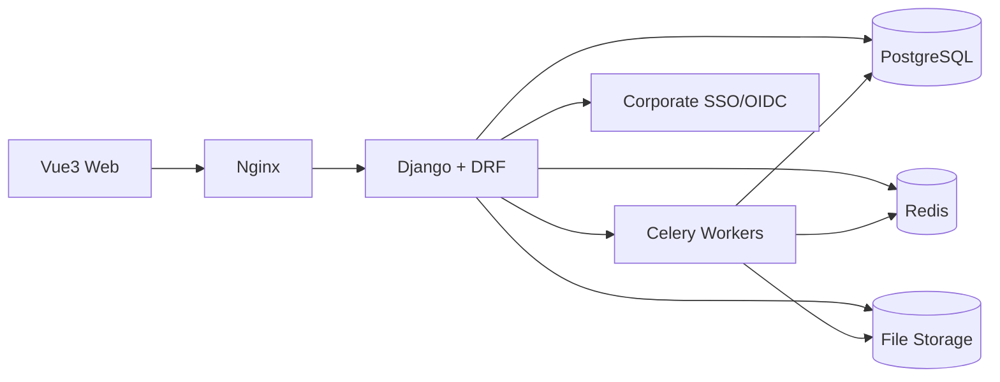

# 研发预算管理系统：需求与架构梳理

## 1. 系统定位

本系统面向研发部门内部使用，用于年度预算编制、版本修订、审批、合并、执行视图和管理看板。系统中没有采购和财务流程参与，财务只作为外部数据来源之一，例如提供 OPEX 集团分摊数据或历史执行数据。

核心目标：

- 让一级部门预算管理员主导预算编制周期、模板、字段、公式、任务分发和预算总表生成。
- 让二级部门预算管理员高效完成 OPEX/CAPEX 编制，支持 Excel 导入导出、批量修改和多版本送审。
- 让二级部门负责人、一级部门管理员主管、一级部门负责人完成各自审批职责，并保留完整修订痕迹。
- 让专题需求收集表可以自定义，并可沉淀为各部门预算条目或挂在 SS public/一级部门下。
- 让一级/二级 Dashboard 可以灵活按字段筛选、下钻、生成图表和表格。

## 2. 角色与权限边界

| 角色 | 核心权限 | 关键限制 |
| --- | --- | --- |
| 一线工程师 | 默认无预算编制访问权限；后续可按专题表单被邀请填写局部信息 | 不能进入预算编制表、预算总表和审批链 |
| 二级部门次预算管理员 | 编辑本二级部门预算、导入导出、批量修改、维护内部 comment 列 | 不能发起二级部门预算送审 |
| 二级部门主预算管理员 | 拥有次预算管理员能力；可发起整个二级部门预算送审 | 只能管理授权二级部门范围 |
| 二级部门负责人 | 审批本部门预算版本；可基于当前最新版本发起修订并留痕 | 不参与一级部门总表终审，不直接改写历史已审批数据 |
| 一级部门预算管理员 | 维护预算周期、模板、字段、下拉、公式、可见性、任务；全局修改；上传集团分摊；创建专题收集表；拉取各部门最新审核版生成一级总表 | 不是最终终版审批人 |
| 一级部门预算管理员主管/主办 | 审核一级部门预算初版和修订版 | 不替代一级部门负责人终审 |
| 一级部门负责人 | 只审批一级部门最终终版 | 不处理二级部门明细送审 |

权限建议采用三层控制：

- RBAC：角色决定可进入哪些模块。
- 数据范围：一级/二级部门、SS public、专题表单实例等对象级权限。
- 字段级权限：字段是否可见、可编辑、可导出、是否进入审批快照。

## 3. 业务模块拆分

### 3.1 组织与主数据

管理部门层级、成本中心、用户角色、项目、项目类别、产品线、category、category L1/L2、供应商、地区、GL Account/GL Amount 映射、历史采购记录等。

建议所有下拉数据都作为主数据维护，并支持生效状态、排序、别名、历史保留。预算模板只引用主数据，不直接写死下拉值。

### 3.2 预算周期与任务

每年建立一个预算周期，例如 `2027 年度预算编制`。一级部门预算管理员在周期内完成模板配置后，一键向二级部门预算管理员分发任务。

任务状态建议：

- 未开始
- 编制中
- 待二级部门负责人审批
- 二级部门负责人退回
- 二级部门负责人已审批
- 已被一级部门拉取
- 一级预算初审中
- 一级预算终审中
- 终版锁定

### 3.3 预算模板设计器

一级部门预算管理员维护 OPEX/CAPEX 预算模板。模板能力需要覆盖：

- 字段配置：字段编码、显示名称、数据类型、是否必填、顺序、宽度、冻结列。
- 输入方式：文本、数字、金额、日期、下拉、多选、用户选择、部门选择、项目选择。
- 下拉来源：静态选项或主数据表。
- 可见性：按角色、部门、预算来源控制显示。
- 编辑性：按角色和预算状态控制是否可编辑。
- 公式：例如总数量、月度金额、总金额等。
- 审批范围：是否进入审批快照。
- 导入导出：Excel 列名映射、校验规则、错误提示。
- Dashboard 标签：字段是否允许成为维度、指标、筛选项或下钻项。
- 模板版本：每个预算周期默认复制上一周期模板；字段发生小幅变化时生成新的 schema version，并在该预算周期内固化。

OPEX 自编预算原始字段建议标准化为：

- 预算编号
- 预算部门
- depart 成本中心代码
- category
- category L1
- category L2
- GL Amount
- Project
- 预算条目描述
- 供应商
- 采购原因
- 总数量
- 地区
- 单价
- 总价
- 备注
- 1-12 月采购数量
- 1-12 月采购金额

CAPEX 可复用同一模板机制，但启用不同字段集合、校验规则和 Dashboard 归类。

### 3.4 预算编制表

二级部门预算编制表需要提供接近 Excel 的体验：

- 行级新增、删除、复制、批量编辑。
- Excel 导入、导出、错误定位和二次导入覆盖策略。
- 动态公式计算和服务端校验。
- 历史采购记录模糊补全。
- 推荐单价：集中采购场景下默认按采购名称做模糊匹配，不按地区匹配，供应商仅作为参考展示或可选过滤；当预算条目描述匹配历史采购名称时，推荐单价 = 历史成交价 * 1.2；用户可接受或覆盖。
- 二级部门自定义 comment 列：仅用于内部管理，不进入审批快照、不进入一级合并口径。
- 一级部门预算管理员追加管理列：可作为标记、说明和临时 Dashboard 字段，由一级管理员决定是否进入分析口径。

### 3.5 版本与审批

预算版本建议采用“Git-like”的数据模型，但交互上保持业务友好。

核心规则：

- 管理员平时编辑的是 Draft。
- 每次送审时，系统自动生成与基准版本的差异。
- 审批通过后生成不可变 Approved Version，版本号自动递增，例如 `V1`、`V2`。
- 每个版本记录 `base_version_id`，为后续版本分支拓扑图、修改热力图和审计分析打基础。
- 二级部门负责人可基于当前最新版本发起修订。当前最新版本可能是最新已审批版本，也可能是最新 Draft；修订后进入新的 Draft/送审流程，通过后再形成新版本。
- 历史 Approved Version 不允许直接修改，只能作为历史快照查看或作为差异对比基准。
- Dashboard 采用版本上下文：管理层默认看最新 Approved Version；审批待办中打开的是本次送审版本的 Dashboard；预算管理员和审批人可切换查看当前 Draft/送审中整体数据，但该视图必须明确标识，不能覆盖默认 Approved 口径。

差异范围建议覆盖：

- 新增/删除预算条目。
- 字段值变更。
- 月度数量和金额变化。
- 总数量、总金额、category、项目、产品线等关键字段变化。
- 与上年预算金额/执行金额的增长比例。

### 3.6 专题需求收集

专题需求收集用于解决跨部门集采、SS public 和一级部门统一编制的场景。

能力要求：

- 一级部门预算管理员可创建任意专题表单模板。
- 模板支持字段自定义、字段隐藏、字段保密、公式、下拉、附件、导入导出。
- 可按部门分发填写任务。
- 一级部门预算管理员可确认、汇总、调整并生成预算条目。
- 生成的预算条目需要保留来源关联，可追溯到专题表单、填写部门和原始行。
- 支持挂到对应二级部门预算，也支持挂到 SS public/一级部门。
- 专题表单生成到二级部门预算中的条目在预算编制表中锁定，二级部门不可直接修改；如需变更，二级部门必须回到专题表单修改需求，再由一级部门预算管理员重新生成或同步预算条目。

典型专题：

- 人力外包需求收集：保密单价仅一级部门可见；二级部门填写项目、入职时间、计划人数等。
- 集采电脑、服务器、结构件、软件：二级部门按需填写，一级确认后自动归集到对应部门预算。

### 3.7 集团分摊预算

OPEX 集团分摊由财务外部提供，但系统内只做数据上传、校验、合并和展示，不走财务审批。

规则建议：

- 一级部门预算管理员单独上传集团分摊数据。
- 集团分摊作为 OPEX 的一个来源类型，与 OPEX 自编相加形成 OPEX 总预算。
- 如果集团分摊为空，一级总表先显示为空或 0，并标记数据未提供。
- 集团分摊需要有独立导入批次、版本、上传人和校验结果。

### 3.8 一级部门预算总表

一级部门预算管理员一键拉取各二级部门最新已审批版本，合并 SS public、专题生成项、集团分摊，形成一级部门预算总表。

建议总表也是一个版本化对象：

- Draft：一级管理员拉取生成后可修订。
- 初审：一级部门预算管理员主管/主办审核。
- 终审：一级部门负责人审批。
- Final：终版锁定。

一级总表不应该直接覆盖二级部门历史版本，而是引用二级部门版本快照。这样可以解释“当时拉取的是哪个部门哪个版本”。

如果一级总表生成后，某个二级部门又审批出新版本，系统应提示“xx 部门有更新”，并提供手动同步按钮。同步必须由一级部门预算管理员触发，不自动覆盖当前一级总表。

## 4. Dashboard 需求

### 4.1 二级部门 Dashboard

需要实时、完整，服务于管理层审阅。核心视图：

- OPEX 条目数量、金额；按 category 的条目数量和金额。
- CAPEX 条目数量、金额；按 category 的条目数量和金额。
- 每条预算相比上年预算金额/执行金额的增长比例。
- OPEX planning monthly by category，图表和明细表展示，支持下钻。
- CAPEX planning monthly by category，图表和明细表展示，支持下钻。
- OPEX/CAPEX 按项目维度的每月预算金额，以及合计金额。
- 全年 OPEX/CAPEX 按项目类别的比例和金额，支持下钻。
- 全年 OPEX/CAPEX 按产品线的比例和金额。

项目类别建议作为主数据维护：量产项目、产品项目、TD 项目、Pathfinding 项目、其他项目。

### 4.2 一级部门 Dashboard

一级部门 Dashboard 大部分口径与二级部门一致，但强调全览和下钻：

- By 部门，含 SS public。
- OPEX by category。
- CAPEX by category。
- By 月。
- By 项目、项目类别、产品线。
- 可从一级汇总下钻到二级部门、预算条目、版本差异。
- 独立版本分析模块：预算编制迭代次数、修改热力图、版本分支拓扑图。

### 4.3 Dashboard 配置能力

所有 Dashboard 建议走统一查询引擎：

- 字段可配置为维度、指标、筛选器、排序字段。
- 查询必须带版本上下文，例如最新 Approved、当前 Draft、本次送审版本、指定历史版本。
- 支持保存看板配置。
- 支持按角色共享看板。
- 支持图表和表格同步下钻。
- 支持导出当前图表数据。

## 5. 后端架构：Django

### 5.1 技术选型

建议后端采用：

- Django 5.x
- Django REST Framework
- PostgreSQL，重点使用 JSONB、索引、物化视图
- Redis，用于缓存、任务锁、导入进度
- Celery，用于 Excel 导入导出、Dashboard 预聚合、版本 Diff 计算
- openpyxl/pandas，用于 Excel 处理
- django-filter，用于列表筛选
- django-simple-history 或自研 AuditLog，用于审计
- corporate SSO/OIDC，若公司已有统一登录；否则先使用 Django auth + JWT/session
- 对象存储或本地文件存储，用于导入文件、导出文件、附件

### 5.2 Django App 拆分

| App | 职责 |
| --- | --- |
| `accounts` | 用户、角色、登录、数据范围 |
| `orgs` | 一级/二级部门、section、成本中心 |
| `masterdata` | category、项目、项目类别、产品线、供应商、地区、历史采购 |
| `budget_cycles` | 年度预算周期、任务分发、状态机 |
| `templates` | 预算模板、字段、选项、公式、字段权限 |
| `budgets` | 预算表、预算行、月度计划、版本、差异 |
| `approvals` | 审批请求、审批节点、退回、审批意见 |
| `allocations` | 集团分摊导入、校验、版本 |
| `demands` | 专题需求表单、填写任务、生成预算条目 |
| `imports` | Excel 导入导出任务、错误报告 |
| `analytics` | Dashboard 查询、指标聚合、物化视图 |
| `audit` | 操作日志、数据变更日志、访问日志 |
| `notifications` | 待办、站内通知、邮件/企业微信提醒 |

### 5.3 核心数据模型

建议采用“结构化主字段 + 动态 JSONB + 月度明细表”的混合模型，既支持灵活模板，也保证 Dashboard 性能。

```text
BudgetCycle
  year, name, status, start_at, end_at

Department
  name, level, parent_id, cost_center_code

BudgetTemplate
  cycle_id, expense_type(OPEX/CAPEX/SPECIAL), name, schema_version, status

TemplateField
  template_id, code, label, data_type, input_type, option_source,
  formula, required, visible_rules, editable_rules, approval_included,
  dashboard_enabled, order

BudgetBook
  cycle_id, department_id, expense_type, source_type,
  template_id, status, current_draft_id, latest_approved_version_id

BudgetVersion
  book_id, version_no, base_version_id, status,
  submitted_by, approved_by, submitted_at, approved_at, snapshot_hash

BudgetLine
  version_id, line_no, budget_no, department_id, cost_center_code,
  category_id, category_l1_id, category_l2_id, gl_amount_code,
  project_id, project_category_id, product_line_id,
  description, vendor_id, reason, region_id,
  unit_price, total_quantity, total_amount,
  dynamic_data JSONB, local_comments JSONB, admin_annotations JSONB,
  source_ref_type, source_ref_id

BudgetMonthlyPlan
  line_id, month, quantity, amount

ApprovalRequest
  target_type, target_id, status, requester_id, current_node

ApprovalStep
  request_id, approver_id, action, comment, acted_at

VersionDiff
  from_version_id, to_version_id, summary JSONB, detail JSONB

DemandTemplate / DemandSheet / DemandLine
  用于专题需求收集和预算条目生成追溯
```

### 5.4 公式与校验

公式必须由后端作为权威计算，前端只做即时预览。

建议：

- 不允许直接执行用户输入的 Python/JS 表达式。
- 设计安全公式 DSL，例如 `sum(month_qty)`、`unit_price * total_quantity`。
- 保存模板时校验公式依赖字段是否存在、是否有循环依赖。
- 保存预算行、导入 Excel、提交审批前均执行公式和校验。
- 关键公式结果写入结构化字段，方便查询和聚合。

默认规则：

- 总数量 = 1-12 月数量加总。
- 月度金额 = 月度数量 * 单价，若模板允许手填金额，则需要校验总金额一致性。
- 总金额 = 1-12 月金额加总，也可与单价 * 总数量互相校验。

## 6. 前端架构：Vue3

### 6.1 技术选型

建议前端采用：

- Vue 3 + Vite + TypeScript
- Vue Router
- Pinia
- Element Plus，适合内部管理系统
- ECharts，用于 Dashboard
- vxe-table 或 AG Grid，用于预算编制表的高性能表格
- @tanstack/vue-query 或统一 API service，用于请求缓存、加载状态和错误处理
- xlsx，仅用于前端预览；正式导入仍以后端校验为准

如果预算表需要非常接近 Excel 的体验，包括冻结窗格、批量粘贴、公式显示、快捷键、筛选、列宽拖拽，优先评估 vxe-table；如果后续需要更重的在线表格能力，可以单独评估 Univer/Luckysheet。

### 6.2 前端模块

```text
src/
  api/
  router/
  stores/
  layouts/
  modules/
    auth/
    workbench/
    orgs/
    masterdata/
    budget-cycle/
    template-designer/
    budget-editor/
    version-diff/
    approvals/
    demand-forms/
    dashboards/
    import-export/
    audit/
  components/
    DataGrid/
    FormulaEditor/
    FieldPermissionEditor/
    DiffViewer/
    DashboardBuilder/
```

核心页面：

- 工作台：我的任务、待审批、导入进度、最近预算周期。
- 预算周期管理。
- 模板设计器。
- 二级部门预算编制表。
- 版本差异与送审页。
- 审批中心。
- 专题需求收集。
- 一级部门预算总表。
- 二级部门 Dashboard。
- 一级部门 Dashboard。
- 主数据管理。
- 审计与版本分析。

### 6.3 预算编制表交互

建议支持：

- 虚拟滚动，避免大表卡顿。
- 单元格校验、错误角标、错误列表定位。
- 批量粘贴 Excel 内容。
- 导入后错误行高亮。
- 行级来源标识：自编、专题生成、集团分摊、SS public。
- 字段可见性和可编辑性由后端返回 schema 控制。
- 送审前展示 Diff 摘要和明细。

## 7. API 设计建议

REST API 可按资源建模：

```text
GET    /api/cycles/
POST   /api/cycles/
POST   /api/cycles/{id}/publish-tasks/

GET    /api/templates/
POST   /api/templates/
PUT    /api/templates/{id}/
POST   /api/templates/{id}/validate/

GET    /api/budget-books/
GET    /api/budget-books/{id}/schema/
GET    /api/budget-books/{id}/lines/
PATCH  /api/budget-books/{id}/lines/bulk/
POST   /api/budget-books/{id}/submit/

GET    /api/budget-versions/{id}/
GET    /api/budget-versions/{id}/diff/?base={base_id}
POST   /api/budget-versions/{id}/create-draft/

POST   /api/import-jobs/
GET    /api/import-jobs/{id}/
GET    /api/import-jobs/{id}/errors/

GET    /api/approval-requests/
POST   /api/approval-requests/{id}/approve/
POST   /api/approval-requests/{id}/reject/

GET    /api/demand-templates/
POST   /api/demand-templates/
POST   /api/demand-sheets/{id}/generate-budget-lines/

POST   /api/allocations/import/

POST   /api/dashboard/query/
POST   /api/dashboard/configs/

GET    /api/purchase-history/suggest/?q=...
```

批量保存预算行建议使用乐观锁：

- 前端提交 `book_id`、`draft_id`、`row_version`。
- 后端发现行已被别人修改时返回冲突。
- 对大批量导入使用异步任务，不阻塞请求。

## 8. 部署与运行架构



推荐环境：

- 开发：Docker Compose，PostgreSQL + Redis + Django + Vue。
- 测试：独立测试库，接入模拟 SSO。
- 生产：Nginx + Gunicorn/Uvicorn + Celery Worker + Celery Beat + PostgreSQL + Redis。
- 文件：预算导入导出、附件和错误报告建议独立存储，避免塞进数据库。

## 9. 关键业务口径建议

- OPEX 总预算 = OPEX 自编 + OPEX 集团分摊。
- OPEX 自编 = 二级部门自编 + 专题生成 + SS public。
- SS public 不分摊，挂在一级部门下，但 Dashboard 中需要可单独展示并参与一级合计。
- 二级部门预算送审只能由主预算管理员发起。
- 次预算管理员可编辑但不可送审。
- 二级部门负责人审批通过后，二级部门最新已审批版本更新。
- 一级部门总表拉取的是各二级部门最新已审批版本，而不是 Draft。
- 一级部门总表生成后，如果二级部门最新已审批版本发生变化，系统提示更新，但由一级部门预算管理员手动同步。
- 二级部门 comment 列不进入审批与一级合并。
- 一级部门追加列可进入 Dashboard，但是否进入审批和合并需要字段级配置。
- 历史 Approved Version 不可被改写；修订只能基于当前最新版本生成新的 Draft，并在审批通过后形成新版本。
- 专题生成的预算条目在预算表中不可由二级部门直接修改，需求变更必须回到专题表单处理。

## 10. MVP 范围建议

### 第一阶段：预算编制闭环

- 用户、角色、部门、成本中心。
- OPEX/CAPEX 基础模板配置。
- 二级部门预算编制表。
- Excel 导入导出、批量修改。
- 基础公式和校验。
- 二级部门送审、负责人审批、版本 Diff。
- 集团分摊导入。
- 一级部门拉取最新已审批版本生成总表。
- 基础一级/二级 Dashboard。

### 第二阶段：配置化与专题收集

- 完整模板设计器。
- 字段级权限和保密字段。
- 专题需求收集表。
- 专题表单生成预算条目。
- 历史采购模糊补全和推荐单价。
- Dashboard 自定义配置和保存。

### 第三阶段：高级管理分析

- 版本分支拓扑图。
- 修改热力图。
- 预算编制迭代次数分析。
- 类智慧城市预算总览大屏。
- 更复杂的公式依赖、跨表计算和预聚合。
- 操作审计、数据血缘、异常变更提醒。

## 11. 已确认业务口径

- 二级部门负责人可基于当前最新版本修订，当前最新版本包括最新已审批版本或最新 Draft。修订后进入新的 Draft/送审流程，通过后形成新版本；历史已审批数据不直接修改。
- 管理层默认看最新 Approved 后的 Dashboard。二级部门负责人、一级部门负责人在审批待办中应看到本次送审版本对应的 Dashboard；同时可切换查看 Draft/送审中整体数据，但不能影响默认 Approved 口径。
- OPEX/CAPEX 模板字段可能有小变化，但默认不变化。每个预算周期默认复制上一周期模板；如发生字段变化，则生成新的 schema version 并固化在该预算周期内。
- 历史采购推荐价主要用于参考。由于集中采购不区分地域，默认按采购名称匹配；供应商不作为默认强匹配条件，避免匹配不到。
- 一级部门预算总表生成后，如果二级部门审批出新版本，系统提示“xx 部门有更新”，并由一级部门预算管理员点击按钮手动同步。
- 专题表单生成到二级部门预算中的条目，二级部门不能在预算表中直接修改；如需调整，只能回到专题表单修改需求，再由一级部门预算管理员根据专题内容重新生成或同步预算条目。
